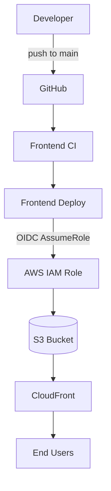
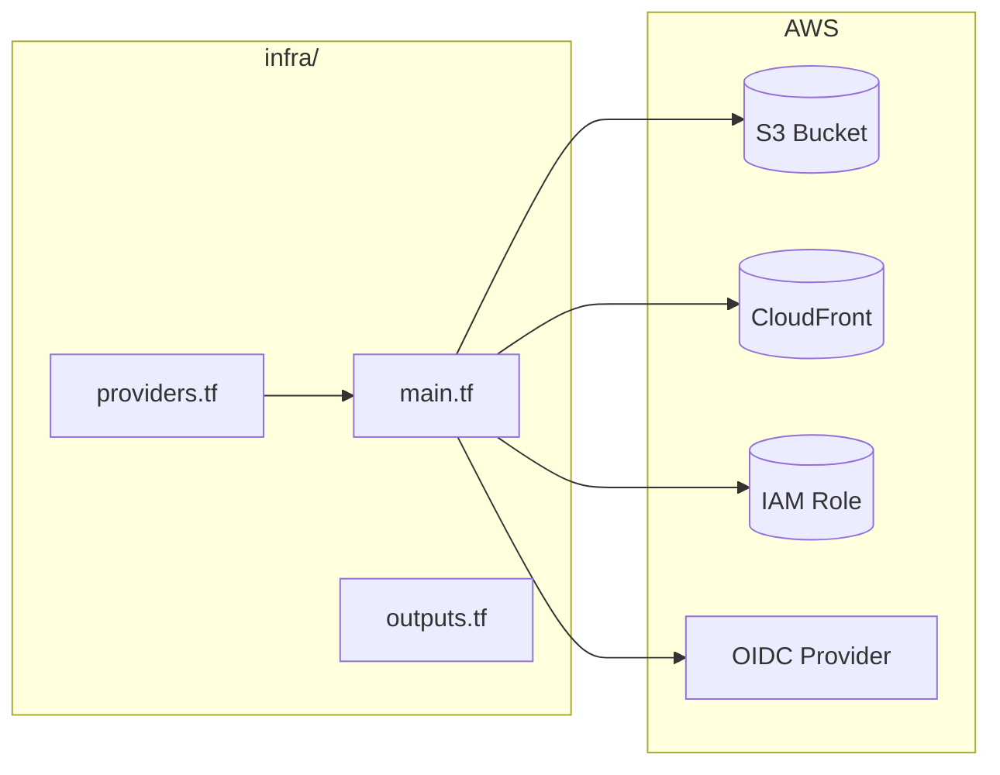

# Fefeave

Reseller business system: Angular frontend (SSR), Fastify backend, Postgres, Terraform-provisioned AWS (S3 + CloudFront for static assets).

---

## 1. Project Overview

| Component | Stack |
| --- | --- |
| Frontend | Angular 20, SSR |
| Backend | Fastify, Node.js, Postgres |
| Infra | Terraform, S3, CloudFront, GitHub Actions (OIDC) |

Monorepo layout: `frontend/`, `backend/`, `infra/`.

---

## 2. Local Development

### Frontend

```bash
cd frontend && npm install && npm start
```

App at `http://localhost:4200/`. Hot reload on save.

### Backend

```bash
cd backend && npm install && npm run dev
```

API at `http://localhost:3000/api`. Requires Postgres and `DATABASE_URL` (or `DB_HOST`, `DB_PORT`, `DB_NAME`, `DB_USER`, `DB_PASSWORD`).

---

## 3. Available Scripts

### Frontend (`frontend/`)

| Script | Command |
| --- | --- |
| `npm start` | Dev server (`ng serve`) |
| `npm run build` | Production build → `dist/` |
| `npm run watch` | Dev build with watch |
| `npm test` | Unit tests (Karma) |

### Backend (`backend/`)

| Script | Command |
| --- | --- |
| `npm run dev` | Dev server with watch |
| `npm run build` | Compile to `dist/` |
| `npm start` | Run compiled app |
| `npm run lint` | ESLint |
| `npm run format` | Prettier |
| `npm test` | Unit tests (Jest, excludes DB smoke) |
| `npm run test:integration` | DB smoke test (requires `DATABASE_URL`) |
| `npm run migrate:up` | Run DB migrations |
| `npm run migrate:down` | Rollback last migration |
| `npm run migrate:create` | Create new migration |

---

## 4. Deployment Overview

- Push to `main` → **Frontend CI** (build, lint, test) → **Frontend Deploy (dev)** auto-runs.
- Prod deploy: run workflow manually or via `make deploy-prod`.
- GitHub Actions uses OIDC to assume an AWS role (no long-lived secrets). Terraform provisions S3, CloudFront, and the OIDC deploy role.

---

## 5. Infrastructure

Terraform lives in `infra/` with workspaces `dev` and `prod`. AWS region: `us-west-2`.

### Deployment flow



### Terraform files → AWS resources



### Make targets (run from repo root)

| Target | Purpose |
| --- | --- |
| `make init` | Terraform init (after provider changes) |
| `make plan-dev` / `make apply-dev` | Plan/apply dev |
| `make plan-prod` / `make apply-prod` | Plan/apply prod |
| `make output-dev` / `make output-prod` | Show outputs |
| `make gh-sync-dev` / `make gh-sync-prod` | Sync TF outputs → GitHub env vars (requires `gh` CLI) |
| `make deploy-dev` / `make deploy-prod` | Trigger deploy workflow via `gh` |

---

## 6. Dev → Prod Workflow

1. **Daily loop:** Code → commit → push. Frontend CI runs; dev deploy runs on CI success.
2. **Promote to prod:** `make deploy-prod` or run “Frontend Deploy (prod)” in GitHub Actions.
3. **Infra changes:** `make plan-dev` → `make apply-dev` → verify → `make plan-prod` → `make apply-prod`.

---

## 7. Troubleshooting

| Issue | Fix |
| --- | --- |
| Backend fails to start | Ensure Postgres is running and `DATABASE_URL` (or split DB vars) is set. |
| `npm run test:integration` fails | Set `DATABASE_URL` to a Postgres instance. |
| Dev deploy not running | Confirm workflow “Frontend Deploy (dev)” is triggered by “Frontend CI” on `main`. |
| `make gh-sync-*` fails | Install `gh` CLI and authenticate (`gh auth login`). |
| Terraform apply fails | Run `make init` after pulling provider or module changes. |
