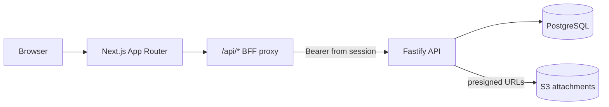

# FefeAve Architecture

Technical overview of how the monorepo is structured and where responsibilities live. For local setup see [DEV.md](DEV.md); for infrastructure operations see [../infra/README.md](../infra/README.md).

---

## System overview

FefeAve supports operating a live-resale business: logging show results, recording what is owed to wholesalers (settlements), recording payments, and exposing balances and statements. The system is split into a **browser-facing Next.js app** and a **Fastify API** backed by **PostgreSQL**. Optional **AWS** resources provide attachment storage, static hosting assets, Cognito (dev), and—when enabled—container hosting.

| Surface               | Role                                                                                                 | Access                                         |
| --------------------- | ---------------------------------------------------------------------------------------------------- | ---------------------------------------------- |
| **Public site**       | Marketing pages (home, about, contact, how-it-works). Env-driven social/live links.                  | Unauthenticated                                |
| **Admin application** | Operator workspace: shows, settlements, payments, balances, exports.                                 | Session cookie; `ADMIN` or `OPERATOR`          |
| **Wholesaler portal** | Read-only statement and CSV export for a linked wholesaler.                                          | Session cookie; `WHOLESALER`                   |
| **Backend API**       | Authoritative business rules, persistence, aggregations, presigned S3 URLs.                          | `Authorization: Bearer` (from session via BFF) |
| **PostgreSQL**        | Financial ledger, users, attachments metadata.                                                       | API only                                       |
| **AWS**               | Attachments bucket (presigned access), optional ECS/RDS/ALB, S3+CloudFront site bucket, dev Cognito. | API and deploy workflows when configured       |

**Design principle:** financial totals, settlement caps, balance math, and permission checks are **server-authoritative**. The UI displays and submits data; it does not define ledger truth.

---

## Architecture diagram



Text equivalent:

```text
Browser
  → Next.js (public | admin | portal | /api/auth/*)
      → same-origin /api/* → app/api/[...path] proxy → Bearer token → Fastify
      → dev only: optional rewrite /api/* → localhost:3000 (when not handled by route)
  → Fastify API (/api/*)
      → PostgreSQL
      → S3 (attachments via presigned POST/GET when S3_ATTACHMENTS_BUCKET is set)
```

---

## Frontend architecture

### App Router route groups

Next.js uses route groups to separate concerns without affecting URLs:

| Group              | Path prefix                     | Purpose                                                                   |
| ------------------ | ------------------------------- | ------------------------------------------------------------------------- |
| `(public)/`        | `/`, `/about`, …                | Marketing layout; `.public-site` token overrides in `(public)/layout.tsx` |
| `(admin)/admin/`   | `/admin/*`                      | Operator workspace (sidebar, dashboards, show workflow)                   |
| `(portal)/portal/` | `/portal/*`                     | Wholesaler statement                                                      |
| `(auth)/`          | `/login`, …                     | Login entry                                                               |
| `app/api/`         | `/api/auth/*`, `/api/[...path]` | Auth callbacks, session health, **BFF proxy** to Fastify                  |

Root `app/layout.tsx` wraps the tree; each group adds its own chrome (e.g. `PublicHeader` vs admin sidebar).

### Public / admin / portal separation

- **Public** uses `frontend/app/(public)/_components/` and `@/system` primitives. Tokens for marketing live under `.public-site` in `frontend/system/tokens.css` (see [design/colors.md](../design/colors.md)).
- **Admin** uses `workspaceUi.ts` and `--admin-*` tokens—intentionally separate from public styling.
- **Portal** reuses session auth but restricts routes to wholesaler-facing pages.

Cross-route shared chrome (e.g. `PublicHeader`) lives in `app/_components/`.

### Shared UI system

`frontend/system/` (`@/system`) provides layout primitives: `Button`, `Card`, `Container`, `Heading`, `Prose`, etc. Public pages compose these; admin pages prefer workspace-specific components documented in `workspaceUi.ts`.

### `workspaceUi`

`frontend/app/(admin)/admin/_components/workspaceUi.ts` is the **admin design contract**: shell background, page intro bands, table/card surfaces, and action tiers (primary, row commit, financial, destructive). New admin UI should reuse these exports rather than ad hoc Tailwind for the same concerns.

### API client organization

Browser calls use **same-origin** `/api` (`NEXT_PUBLIC_BACKEND_URL=/api`):

1. **`frontend/app/api/[...path]/route.ts`** — BFF proxy. Reads the signed session cookie, forwards requests to `BACKEND_BASE_URL` with `Authorization: Bearer <access_token>`.
2. **`frontend/src/lib/api/backend.ts`** — `backendGetJson` / `backendMutateJson` with `credentials: 'include'`.
3. **`frontend/src/lib/api/*.ts`** — Domain-typed clients (shows, wholesalers, payments, attachments, …) used by most admin screens.
4. **`frontend/lib/api.ts`** — Lighter `apiGet` / `apiGetText` helpers; still used in some admin pages (e.g. balances CSV).

In local development, `next.config.ts` can rewrite `/api/*` to `http://localhost:3000/api/*`, but API routes under `app/api/` take precedence for proxied backend traffic.

Related: [frontend/AUTH_SETUP.md](../frontend/AUTH_SETUP.md), [frontend/app/(public)/\_components/README.md](<../frontend/app/(public)/_components/README.md>).

---

## Backend architecture

### Route layer

`backend/src/routes/` registers Fastify handlers (validation with Zod, Swagger metadata, `preHandler` guards). Routes are mounted under `API_PREFIX` (default `/api`) from `backend/src/index.ts`.

Responsibilities: HTTP shape, auth guards, orchestration, calling services/read-models, choosing `withTx` for writes.

### Services layer

`backend/src/services/` holds **business invariants** that are not simple SQL:

- Settlement create validation (`show-settlement-create-validation.ts`): payout caps, duplicate wholesaler per show, percent totals.
- Wholesaler statement assembly (`wholesaler-statement.ts`): ledger entry shape for admin/portal UI.
- Owner payout helpers, balances view helpers, etc.

Prefer adding invariant checks here (or in dedicated service modules) rather than duplicating rules in the UI.

### Read-model layer

`backend/src/read-models/` holds **authoritative aggregations** for reporting:

- `balances.ts` — wholesaler owed/paid/balance (documents itself as the only place for that math).
- `ledger-entries.ts`, `unpaid-closed-shows.ts`, etc.

Read models accept a `QueryableDb` (`read-models/db.ts`) so they can run inside or outside transactions.

### Database layer

- `backend/src/db/index.ts` — connection pool, `withTx` (BEGIN/COMMIT/ROLLBACK).
- `backend/src/db/ensure-user.ts` — user row alignment with Cognito sub.
- `backend/migrations/` — `node-pg-migrate`; soft delete via `deleted_at` on ledger tables.

Money is stored as `numeric`; API layers expose string decimals where appropriate.

### Transaction model

Multi-step writes use `withTx(async (client) => { ... })` so settlement + side effects commit atomically. Read-only handlers typically use `getPool().query` or read-models without a transaction unless consistency requires it.

### Auth plugin

`backend/src/plugins/auth.ts` runs on every request when `AUTH_MODE` is not `off`:

| `AUTH_MODE`  | Behavior                                                                                     |
| ------------ | -------------------------------------------------------------------------------------------- |
| `off`        | No `request.user`; most business routes still use `requireAuth` and will 401                 |
| `dev_bypass` | Fixed dev identity from `AUTH_DEV_BYPASS_*` env; optional `x-dev-user` override when allowed |
| `cognito`    | JWT verified via Cognito JWKS; roles from token claims                                       |

In `NODE_ENV=development`, the fixed bearer `fefeave-local-dev-bootstrap` is accepted so Playwright/dev-bootstrap can match the BFF token without Cognito.

`request.user` is set on the Fastify request; route `preHandler` chains use `requireAuth` and `requireRole` from `backend/src/auth/guards.ts`.

### Error handling

`backend/src/utils/errors.ts` defines `AppError` subclasses (`ValidationError`, `NotFoundError`, `UnauthorizedError`, `ForbiddenError`, `ConflictError`) with HTTP status and optional `code`. A global Fastify `errorHandler` maps these (and Zod failures) to JSON responses. Example: closed show edits return **409 Conflict** with a clear message from `owed-line-items` routes.

---

## Financial domain architecture

### Core concepts

| Concept             | Storage / API                                       | Meaning                                                                            |
| ------------------- | --------------------------------------------------- | ---------------------------------------------------------------------------------- |
| **Show**            | `shows`                                             | A live selling event (date, platform, status e.g. `COMPLETED`)                     |
| **Show financials** | `show_financials`                                   | Payout after fees for a show (input to settlement caps)                            |
| **Settlement**      | `owed_line_items` (`obligation_kind = SHOW_LINKED`) | Amount owed to a wholesaler for a show (`PERCENT_PAYOUT`, `MANUAL`, `ITEMIZED`)    |
| **Vendor expense**  | `owed_line_items` (`VENDOR_EXPENSE`)                | Non-show obligation (no `show_id`)                                                 |
| **Payment**         | `payments`                                          | Cash applied to reduce wholesaler balance                                          |
| **Account**         | `accounts`                                          | Canonical wholesaler identity; legacy `wholesaler_id` still joined in aggregations |
| **Balances**        | read-model `readWholesalerBalances`                 | owed − paid per account                                                            |
| **Statement**       | service `wholesaler-statement`                      | Chronological ledger with running balance for admin/portal                         |

### Server-authoritative calculations

- **Balances** — computed only in `read-models/balances.ts` (and related SQL), not in React.
- **Settlement totals vs payout** — enforced in `show-settlement-create-validation.ts` before insert.
- **Statements / exports** — built on the server from the same tables the API mutates.

### Settlement invariants (examples)

- One settlement-shaped owed line per wholesaler per show (`assertNoDuplicateSettlementForWholesaler`).
- Sum of show-linked settlements cannot exceed `payout_after_fees` (within a small epsilon), unless existing data already exceeds cap (then new lines cannot increase total owed).
- **Closed shows** (`status = COMPLETED`): mutating settlements returns **409** until the show is reopened.

### Balance aggregation ownership

Wholesaler balance is **owed line items − payments**, with queries matching either `account_id` or legacy `wholesaler_id`. Portal and admin views consume the same read-models/services so operators and wholesalers see consistent numbers.

---

## Authentication architecture

### Two layers

1. **Browser session** — `httpOnly` cookie `fefeave_session` (HMAC-signed payload with Cognito tokens or dev-bootstrap token). Middleware in `frontend/middleware.ts` protects `/admin/*` and `/portal/*` by role.
2. **API authorization** — Fastify `authPlugin` + per-route `requireAuth` / `requireRole`. The BFF attaches `Bearer` from the session on every `/api/*` proxy call.

### `AUTH_MODE` (backend)

See [backend/README.md](../backend/README.md) and [frontend/AUTH_SETUP.md](../frontend/AUTH_SETUP.md).

- **`make dev`** sets `AUTH_MODE=dev_bypass` on the API process.
- **`make dev-cognito`** sets `AUTH_MODE=cognito` for Hosted UI testing.

### Session cookies

Issued by `/api/auth/callback` (Cognito) or `/api/auth/dev-bootstrap` (localhost-only, requires backend `dev_bypass` and env flags). Cookie carries `access_token` used by the BFF.

### Middleware protection

| Path                    | Rule                              |
| ----------------------- | --------------------------------- |
| `/admin/*`              | Requires `ADMIN` or `OPERATOR`    |
| `/portal/*`             | Requires `WHOLESALER`             |
| `/login`, `/api/auth/*` | Not gated (avoids redirect loops) |

Wrong role → redirect to `/403`.

### API authorization

Even with a valid session cookie, each API route enforces roles (e.g. portal routes vs admin routes). Missing or invalid bearer → **401**; insufficient role → **403**.

---

## Infrastructure architecture

Terraform lives in `infra/` with workspaces `dev` and `prod`. See [infra/README.md](../infra/README.md) for variables, outputs, and workflows.

### Local-first philosophy

Committed `dev.tfvars` and `prod.tfvars` set `create_backend_infra = false` and `create_rds = false`. Day-to-day development uses Docker Postgres and `make dev` on the workstation—not ECS.

### Always provisioned (typical apply)

- S3 bucket + CloudFront (static site origin; SPA fallback)
- Attachments S3 bucket (private; TLS/encryption policies)
- IAM role for backend tasks to access attachments
- Cognito user pool (dev workspace only)

### Optional ECS / RDS (`create_backend_infra = true`)

When enabled: VPC, ECR repos, ALB, ECS services for frontend and backend, optional RDS and Secrets Manager `DATABASE_URL`. GitHub Actions **Backend Deploy** and **Frontend Deploy** workflows push images and update ECS services—only meaningful when this flag is on and GitHub env vars are set.

### CloudFront and S3

CloudFront serves the **site** bucket (OAC, no public bucket ACL). Attachments are **not** served via CloudFront; the API issues short-lived presigned URLs.

### S3 attachments

Upload flow: API validates auth → presigned POST → client uploads directly to S3 → API records metadata and links to shows/payments/settlements. Download uses presigned GET. Bucket name from `S3_ATTACHMENTS_BUCKET` (see `backend/src/lib/s3Presign.ts`).

---

## Testing strategy

| Layer                 | Command                                  | Scope                                                                                      |
| --------------------- | ---------------------------------------- | ------------------------------------------------------------------------------------------ |
| **Unit tests**        | `cd backend && npm test`                 | Jest; excludes all `*-integration*` and DB smoke patterns                                  |
| **Integration tests** | `cd backend && npm run test:integration` | Docker Postgres if needed; isolated `test` schema; full ledger/API suites                  |
| **Repo check**        | `make check`                             | Format, project-head script, lint (backend + frontend), backend unit tests, frontend build |

### Database-backed tests

Integration tests reset schema `test` before running. They cover shows, settlements, payments, portal, exports, closed-show freeze, attachments linking, etc. (see `backend/scripts/run-integration-tests.sh` for the Jest pattern list).

### CI behavior

- **Backend CI** (on `backend/**` changes): format check, project-head test, lint, **unit tests only**.
- **Frontend CI** (on `frontend/**` changes): `npm audit`, **production build** (no lint in workflow today).

**Integration tests are not run in CI**; run them locally before changing migrations, settlements, or balance logic.

Details: [testing.md](testing.md), [backend/README.md](../backend/README.md) § Integration Tests.

---

## Related documentation

| Document                                            | Topic                                   |
| --------------------------------------------------- | --------------------------------------- |
| [README.md](../README.md)                           | Repo entry, quick start                 |
| [DEV.md](DEV.md)                                    | Ports, `make dev`, troubleshooting      |
| [roadmap.md](roadmap.md)                            | V1 scope and phases                     |
| [internal/agent-spec.md](internal/agent-spec.md)    | Endpoint / DB / infra change checklists |
| [frontend/AUTH_SETUP.md](../frontend/AUTH_SETUP.md) | Cognito env and local smoke tests       |
| [infra/README.md](../infra/README.md)               | Terraform and deploy paths              |
