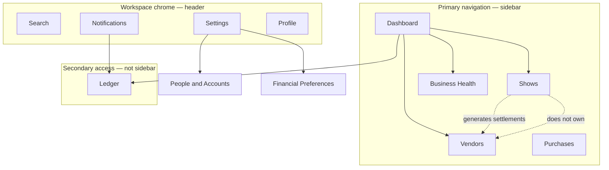

# Reseller Workspace v2 — Product Architecture Decision

**Status:** Approved  
**Last updated:** 2026-06-12  
**Audience:** Product, design, frontend, and implementation  
**Scope:** Reseller/operator workspace information architecture (`/admin/*`), navigation, routes, and phased migration

**Related:**

- [`financial-decision-center-plan.md`](./financial-decision-center-plan.md) — recommendation math and event-backed cash (backend behavior unchanged by this doc)
- [`financials-vision-v2.md`](./financials-vision-v2.md) — financial product vision
- [`../architecture/financial-event-sourcing.md`](../architecture/financial-event-sourcing.md) — event ledger (not navigation)
- [`../architecture/notifications-attention.md`](../architecture/notifications-attention.md) — bell dropdown, attention vs notifications vs ledger (V1)

---

## Executive Summary

FefeAve’s operator experience is a **reseller workspace**, not a traditional admin dashboard organized around database tables and internal module names.

Navigation is approved as **five workflow areas in the sidebar** (Dashboard, Shows, Vendors, Purchases, Business Health) plus **workspace chrome in the header** (Search, Notifications, Settings, Profile). The former “Financials” dropdown with nine equal children is **retired** and must not be recreated.

**Dashboard** is the single command center for “what needs attention now,” including allocation guidance, alerts, and recent activity summaries. There will be **no separate Financials overview page** that duplicates dashboard responsibilities.

**Ledger** (event history) remains available but is **not primary navigation**; it is reached from Dashboard, notifications, direct links, and future reporting.

Implementation proceeds in three phases: shell and redirects first, workflow consolidation second, dashboard and ledger integration third.

---

## Philosophy

### Reseller mental model

Operators should think in terms of **business workflows**:

| Workflow            | User question                                             |
| ------------------- | --------------------------------------------------------- |
| **Selling**         | What shows am I running or closing?                       |
| **Sourcing**        | Who do I owe, and what is their history?                  |
| **Purchases**       | What money left the business (overhead and inventory)?    |
| **Business Health** | What can I safely take home, and what did I already take? |

They should **not** need to map product areas to backend concepts such as balances, accounts, payments, or financial strategy settings.

### Design principles

1. **Workflows over entities** — Navigation names describe jobs, not tables or API resources.
2. **One command center** — Dashboard owns attention, alerts, and cross-workflow summaries.
3. **Chrome vs. work** — Settings and account controls live in the header; the sidebar is for daily workflows only.
4. **Shows create money movement; downstream workflows consume it** — Shows own the sell/close/settle loop; Vendors and Purchases own obligations and outflows. Vendors are **not** children of Shows.
5. **No regression to Financials hierarchy** — Do not reintroduce an expandable “Financials” parent with many peer children.

### What this document does not change

- URL prefix `/admin/*` and auth roles (`ADMIN`, `OPERATOR`) may remain for middleware and deployment stability; **labels and IA** follow reseller language.
- Backend APIs, `financial_events`, and server-side calculations are out of scope unless a phase explicitly requires route or UI wiring only.
- Wholesaler **portal** (`/portal/*`) is unchanged.

---

## Information Architecture Diagram

**Reading the diagram:** Sidebar items are peers. Settings opens from the gear, not the sidebar. Ledger is reachable from Dashboard and Notifications but is not a sixth sidebar item.

---

## Navigation Specification

### Sidebar (primary)

Flat list only — **no expandable Financials section**, no nested sidebar groups in v2.

| Order | Label               | Purpose                                                               |
| ----: | ------------------- | --------------------------------------------------------------------- |
|     1 | **Dashboard**       | Business command center                                               |
|     2 | **Shows**           | Selling events: create, edit, close, settlements, show profit         |
|     3 | **Vendors**         | Supplier relationships: balances, statements, pay, batch pay, history |
|     4 | **Purchases**       | Money leaving the business: expenses and inventory purchases          |
|     5 | **Business Health** | Cash position, strategy recommendations, and owner payout execution   |

**Active-state matching** should highlight the correct item for detail routes (e.g. `/admin/vendors/[id]` → Vendors; `/admin/shows/[id]` → Shows).

### Header (workspace chrome)

Persistent on all reseller workspace routes.

| Control           | Purpose                                  | v2 behavior                                                                                                      |
| ----------------- | ---------------------------------------- | ---------------------------------------------------------------------------------------------------------------- |
| **Search**        | Find shows, vendors, and records quickly | Placeholder in header until command/search is implemented; desktop-first acceptable in Phase 1                   |
| **Notifications** | Attention + recent business updates      | Bell dropdown: **Needs attention** (derived) + **Recent updates** (persisted); badge = unread notifications only |
| **Settings**      | Workspace configuration                  | Gear icon; not a workflow                                                                                        |
| **Profile**       | Identity and session                     | Avatar/menu: email, roles (read-only), sign out                                                                  |

**Page-level actions** (e.g. “Log show,” “New vendor”) may continue to register in the header action area **after** chrome icons, via existing header slot patterns.

### Explicitly not in sidebar

| Retired or demoted                     | Replacement                                   |
| -------------------------------------- | --------------------------------------------- |
| Financials (parent)                    | Removed                                       |
| Overview / Financials dashboard        | **Dashboard** only                            |
| Activity                               | **Ledger** (secondary)                        |
| Balances                               | **Vendors**                                   |
| Payments (global list)                 | **Vendors** (pay from statement or batch pay) |
| Accounts                               | **Settings → People & Accounts**              |
| Owner Activity (as separate nav label) | **Business Health → Payout history**          |
| Inventory (top-level)                  | **Purchases → Inventory**                     |
| Expenses (top-level)                   | **Purchases → Expenses**                      |
| Strategy                               | **Settings → Financial Preferences**          |

---

## Route Specification

### Canonical routes (target)

| Area                  | Canonical path              | Notes                                                                    |
| --------------------- | --------------------------- | ------------------------------------------------------------------------ |
| Dashboard             | `/admin/dashboard`          | `/admin` redirects here                                                  |
| Shows                 | `/admin/shows`              | Includes `/admin/shows/new`, `/admin/shows/[id]`                         |
| Vendors               | `/admin/vendors`            | Includes `/admin/vendors/[id]`, batch pay, payment forms                 |
| Purchases             | `/admin/purchases`          | Tabs or sections: expenses, inventory (`/admin/spending` redirects here) |
| Business Health       | `/admin/business-health`    | Cash position, period plan, execution tracking, payout history           |
| Settings hub          | `/admin/settings`           | Header only                                                              |
| People & Accounts     | `/admin/settings/accounts`  | Vendor/owner account setup                                               |
| Financial Preferences | `/admin/settings/financial` | Strategy presets, tax/buffer/reinvestment                                |
| Ledger                | `/admin/ledger`             | Secondary; not in sidebar                                                |

### Recommended redirects (migration)

Implement via Next.js `redirect()` or equivalent. Old bookmarks must keep working through launch.

| Legacy path                         | Redirect to                                                                         |
| ----------------------------------- | ----------------------------------------------------------------------------------- |
| `/admin`                            | `/admin/dashboard`                                                                  |
| `/admin/financials`                 | `/admin/dashboard`                                                                  |
| `/admin/financials/activity`        | `/admin/ledger`                                                                     |
| `/admin/balances`                   | `/admin/vendors`                                                                    |
| `/admin/wholesalers`                | `/admin/vendors`                                                                    |
| `/admin/wholesalers/[id]`           | `/admin/vendors/[id]`                                                               |
| `/admin/wholesalers/[id]/batch-pay` | `/admin/vendors/batch-pay` or `/admin/vendors/[id]/batch-pay`                       |
| `/admin/balances/owner`             | `/admin/business-health`                                                            |
| `/admin/owner`                      | `/admin/business-health`                                                            |
| `/admin/expenses`                   | `/admin/purchases?tab=expenses`                                                     |
| `/admin/inventory`                  | `/admin/purchases?tab=inventory`                                                    |
| `/admin/spending`                   | `/admin/purchases` (preserve `tab` query when present)                              |
| `/admin/balances/accounts`          | `/admin/settings/accounts`                                                          |
| `/admin/strategy`                   | `/admin/settings/financial`                                                         |
| `/admin/payments`                   | `/admin/ledger?type=payment` or `/admin/vendors` (product choice at implementation) |
| `/admin/payments/new`               | `/admin/vendors` with guidance to select vendor, or vendor-scoped payment route     |

Redirects are **recommended** for Phase 1; exact payment-list behavior may be finalized in Phase 2 when Vendors workflow consolidates.

---

## Workflow Explanation

### Dashboard

**Purpose:** The only dashboard — business command center.

**Contains (target):**

- Active shows and shows requiring closeout
- Vendor payment attention (who is owed, outstanding totals)
- Owner payout recommendation (safe draw / weekly payout status)
- Recent activity (summary with link to Ledger)
- Alerts and quick actions (log show, pay vendor, reconcile cash, etc.)

**Does not contain:** A duplicate “Financials overview” route or second allocation-plan home. Allocation and cash guidance live **on Dashboard** or link to Settings for policy edits.

### Shows

**Purpose:** Manage selling events — the source of most business activity.

**Responsibilities:**

- Create and edit shows
- Close shows and lock financials
- Settlement workflows (owed lines tied to a show)
- Show profitability (including event-backed profit for closed shows)

**Boundary:** Shows **generate** downstream financial activity (settlements, payout events) but **do not** own vendor management, global balances, or paying vendors except where the show detail surface links into Vendors.

### Vendors

**Purpose:** Manage supplier relationships and obligations **independent of any single show**.

**Responsibilities:**

- Balances (who is owed, payment status)
- Per-vendor statements (ledger, settlements, payments, vendor expenses)
- Record payment and batch pay
- Vendor history

**Important:** Vendors exist for consignment, pallet buys, wholesale inventory, and other non-show sourcing. **Do not model vendors as children of Shows** in navigation or IA.

### Purchases

**Purpose:** Track money leaving the business that is not vendor settlement.

**Sections:**

- **Expenses** — general business overhead
- **Inventory purchases** — restock and inventory spend

Inventory and Expenses are **sections under Purchases**, not separate primary navigation items.

### Business Health

**Purpose:** Cash guidance, strategy recommendations, and owner payout execution.

**Sections (top to bottom):**

- **Cash position** — estimated cash, snapshot anchor, inflows/outflows, reconcile snapshot, link to ledger
- **This Period Plan** — tax/reinvest/buffer targets, safe owner draw waterfall, links to Financial Preferences / Purchases / Vendors
- **Execution tracking** — record tax set-aside, reinvestment, and owner payout for the current period
- **Payout history** — prior periods; view in ledger

**Legacy routes:** `/admin/owner`, `/admin/balances/owner`, and `/admin/spending` redirect to canonical paths above.

**Status:** Primary sidebar item. Owner payout APIs and ledger history remain separate from Settings (configuration only).

### Settings

**Purpose:** Workspace configuration — **not** a daily workflow.

**Access:** Header gear only (not sidebar).

| Section                   | Content                                                            |
| ------------------------- | ------------------------------------------------------------------ |
| **People & Accounts**     | Wholesaler/vendor accounts, owner account linkage, directory setup |
| **Financial Preferences** | Strategy type, tax reserve %, reinvestment %, cash buffer          |

**Future sections (not v2 commitment):** Integrations, notification preferences, workspace preferences.

### Notifications and attention

Three related surfaces — do not conflate them:

| Surface           | Meaning                                                              | V1 access                                            |
| ----------------- | -------------------------------------------------------------------- | ---------------------------------------------------- |
| **Attention**     | Derived current-state queue (open shows, vendors owed, fetch errors) | Bell dropdown → Needs attention                      |
| **Notifications** | Persisted read/unread business updates (payments, show closed, etc.) | Bell dropdown → Recent updates                       |
| **Ledger**        | Financial audit history (`financial_events`)                         | Bell footer → View ledger; Dashboard recent activity |

**Bell (V1):** Header button opens a dropdown (not a Dashboard deep link). Numeric badge counts **unread notifications only**. When unread is zero but attention items exist, a subtle dot may appear on the bell — attention does not add to the numeric badge.

Dashboard may still summarize workflow state; it does not replace the bell dropdown for notifications.

See [`../architecture/notifications-attention.md`](../architecture/notifications-attention.md).

### Ledger

**Purpose:** Authoritative **audit timeline** of financial events (`financial_events`).

**Access (not sidebar):**

- Dashboard “Recent activity” with link to full Ledger
- Notifications (when an event type warrants attention)
- Direct URL `/admin/ledger`
- Future reporting exports

Ledger replaces the old **Activity** label in navigation; it is the same conceptual surface with clearer naming for operators.

---

## Migration Plan

### Phase 1 — Shell and wayfinding

**Goal:** Lock navigation and chrome without large page merges.

| Deliverable         | Description                                                         |
| ------------------- | ------------------------------------------------------------------- |
| Sidebar             | Five flat items; remove Financials expandable section               |
| Header              | Search placeholder, Notifications bell, Settings gear, Profile menu |
| Profile relocation  | Move sign-out and identity from sidebar footer to header            |
| Settings relocation | Routes under `/admin/settings/*`; gear entry point                  |
| Redirects           | Legacy paths → canonical paths (see table above)                    |
| Dashboard anchor    | Notifications bell opens dropdown (not `#attention` deep link)      |

**Out of scope for Phase 1:** Merging Expenses + Inventory UI, moving wholesaler detail file tree, Ledger rename implementation beyond redirect alias, removing all `FinancialsCrossLinks`.

### Phase 2 — Workflow consolidation

**Goal:** Align page structure with approved workflows.

| Deliverable               | Description                                                                       |
| ------------------------- | --------------------------------------------------------------------------------- |
| Purchases                 | Single `/admin/purchases` with Expenses and Inventory sections/tabs               |
| Vendors                   | Consolidate balances list, statement, pay flows under `/admin/vendors`            |
| Business Health           | `/admin/business-health` with period plan, execution tracking, and payout history |
| Payments                  | Remove or demote global payments list; pay from vendor context                    |
| Breadcrumbs / cross-links | Update to new route constants; reduce `FinancialsCrossLinks`                      |

### Phase 3 — Command center and ledger

**Goal:** Dashboard as the single home; Ledger integrated as secondary.

| Deliverable       | Description                                                                |
| ----------------- | -------------------------------------------------------------------------- |
| Dashboard         | Absorb allocation/plan UX from retired Financials overview; refine alerts  |
| Ledger            | First-class page at `/admin/ledger`; linked from Dashboard                 |
| Notification bell | Dropdown: Needs attention + Recent updates; unread-only badge (V1 shipped) |
| Search            | Wire command palette or search API                                         |

---

## Risks

| Risk                                 | Impact                                               | Mitigation                                                                  |
| ------------------------------------ | ---------------------------------------------------- | --------------------------------------------------------------------------- |
| Bookmark and training breakage       | Operators lose familiar URLs                         | Comprehensive redirects; active nav match on legacy paths during transition |
| Header overcrowding                  | Search + 3 chrome icons + page CTAs                  | Fixed order: brand \| search (flex) \| chrome \| page actions               |
| Duplicate Dashboard vs. old Overview | Two “homes” for cash guidance                        | Explicit non-goal; retire `/admin/financials` to Dashboard                  |
| Vendors under Shows confusion        | Wrong mental model                                   | IA doc + nav: Vendors is peer of Shows                                      |
| Owner history in Settings            | Users cannot find transactions                       | Explicit non-goal; Business Health stays primary                            |
| Legacy spending URLs                 | Old `/admin/expenses` or `/admin/spending` bookmarks | Redirects + sidebar label “Purchases”                                       |
| Portal vs. workspace naming          | Code still says `admin`                              | Document: URL/internal name ≠ product language                              |
| Event-backed UI on old routes        | Broken screens during migration                      | Redirect first; move components in Phase 2                                  |

---

## Future Considerations

These are **not** approved for v2 but may be revisited with usage data:

- **Business Health** as Dashboard-only widget vs. keeping sidebar item
- **Global payments list** vs. vendor-only pay entry points
- **Search** as command palette (shows, vendors, quick actions)
- **URL rename** `/admin` → `/workspace` (requires middleware and auth doc updates)
- **Integrations** under Settings (accounting export, bank feed) — non-goal until requested
- **Ledger** filters shared with notification rules
- **Mobile search** icon and sheet when desktop placeholder is insufficient

---

## Decision Log

| Date       | Decision                                                       | Rationale                                                   |
| ---------- | -------------------------------------------------------------- | ----------------------------------------------------------- |
| 2026-06-01 | Reseller workspace framing replaces “admin dashboard” language | Matches operator (Felicia) mental model and go-to-market    |
| 2026-06-01 | Sidebar: Dashboard, Shows, Vendors, Purchases, Business Health | Five workflows; no Financials parent                        |
| 2026-06-01 | Header: Search, Notifications, Settings, Profile               | Chrome vs. work separation; settings not in sidebar         |
| 2026-06-01 | Single Dashboard; no Financials overview page                  | Avoid duplicate command centers                             |
| 2026-06-01 | Vendors independent of Shows in IA                             | Consignment and wholesale buys are not show children        |
| 2026-06-01 | Purchases consolidates Expenses + Inventory                    | One “money out” workflow                                    |
| 2026-06-01 | Business Health remains primary nav with execution + history   | Transaction history must not live in Settings               |
| 2026-06-01 | Settings: People & Accounts, Financial Preferences             | Configuration only in header                                |
| 2026-06-01 | Ledger secondary; not sidebar                                  | Reduce nav count; history via Dashboard/notifications       |
| 2026-06-12 | Notifications V1: bell dropdown + unread badge                 | Attention derived; notifications persisted; ledger separate |

---

## Explicit Non-Goals

The following are **out of scope** for reseller workspace v2 and must not be reintroduced without a new ADR:

1. Recreate the old **Financials** hierarchy (Overview, Activity, Balances, Payments, Accounts, Owner Activity, Inventory, Expenses, Strategy as sidebar peers).
2. Create **multiple dashboards** or a separate Financials overview dashboard.
3. Move **Vendors under Shows** in navigation or information hierarchy.
4. Place **Owner payout history** inside Settings.
5. Expose **backend entities** as first-class navigation (accounts, payments table, financial strategy, wholesaler as nav label).
6. Promote **Ledger** to primary sidebar navigation in v2.
7. Auto-run **production** seed, backfill, or deploy changes as part of UI IA work (operational docs remain separate).

---

## Implementation References

When implementing, prefer updating these integration points (current codebase):

| Concern     | Current location                                                         | Target                          |
| ----------- | ------------------------------------------------------------------------ | ------------------------------- |
| Sidebar nav | `frontend/app/(admin)/admin/_lib/adminSidebarNav.ts`, `AdminSidebar.tsx` | Flat five-item config           |
| Header      | `WorkspaceHeader.tsx`, new chrome components                             | Bell, gear, profile             |
| Layout      | `AdminLayoutClient.tsx`                                                  | Session props to header         |
| Breadcrumbs | `adminSidebarNav.ts` exports, `AdminEntityBreadcrumb.tsx`                | Vendor/purchases/settings paths |
| Cross-links | `FinancialsCrossLinks.tsx`                                               | Remove after Phase 2            |

Operational dev data: `make dev-seed`, `make dev-seed-verify` — see [`../DEV.md`](../DEV.md).

---

_This document is the source of truth for reseller workspace v2 navigation and route direction. If implementation diverges, update this document or record a new decision in the Decision Log._
